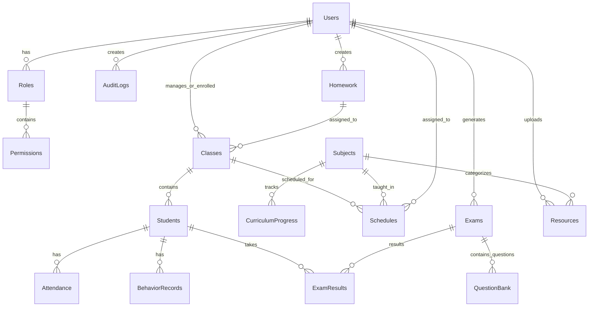

# بنية النظام (System Architecture)

## نظرة عامة
تم تصميم منصة العمليات المدرسية (SOP) باستخدام معمارية مبنية على المكونات (Component-Based Architecture) لضمان التوسع السلس والأداء المتميز. سيتم تقسيم النظام إلى طبقات واضحة (Clean Architecture).

- **الواجهة الأمامية (Frontend):** React.js باستخدام Vite، TailwindCSS لتصميم الواجهات (مع دعم كامل للغة العربية RTL)، و React Router للتنقل.
- **الواجهة الخلفية (Backend):** Node.js مع Express.js لبناء واجهة برمجة تطبيقات (RESTful API).
- **قاعدة البيانات (Database):** PostgreSQL (أو عبر Cloud SQL) للتعامل مع العلاقات المعقدة بين الجداول (مثل الطلاب، الفصول، الحضور، العلامات)، مما يضمن تكامل البيانات (Data Integrity) ودعم الفهارس والقيود بقوة.
- **الذكاء الاصطناعي (AI):** تكامل مع Gemini API لإنشاء الاختبارات، تلخيص الدروس، وتحليل أداء الطلاب.
- **تخزين الملفات (File Storage):** التخزين السحابي الآمن لملفات الواجبات، بنك الموارد، والتقارير (مثل Firebase Storage أو Google Cloud Storage).

---

# مخطط الكيانات والعلاقات (ERD Diagram)

---

# مخطط قاعدة البيانات (Database Schema)

- **Users:** (ID, EmployeeCode, PasswordHash, Name, RoleID, IsActive, CreatedAt)
- **Roles:** (ID, Name [Developer, Admin, Supervisor, Teacher])
- **Permissions:** (ID, RoleID, Module, CanCreate, CanRead, CanUpdate, CanDelete)
- **Students:** (ID, FullName, StudentID, PhotoURL, Grade, ClassID, ParentName, ParentPhone, QRCode)
- **Classes:** (ID, Grade, SectionName [A, B, C, D])
- **Subjects:** (ID, Name, Grade)
- **Attendance:** (ID, StudentID, ClassID, Date, Status [Present, Absent, Late])
- **BehaviorRecords:** (ID, StudentID, TeacherID, Date, Category, Notes)
- **Homework:** (ID, TeacherID, ClassID, Title, Description, FileURLs, DueDate)
- **CurriculumProgress:** (ID, ClassID, SubjectID, TeacherID, Date, LessonDetails, IsCompleted)
- **Resources:** (ID, SubjectID, Type, FileURL, UploadedBy)
- **Exams:** (ID, SubjectID, TeacherID, Title, Difficulty, GeneratedByAI)
- **QuestionBank:** (ID, SubjectID, Text, Type, Difficulty, AnswerKey)
- **ExamResults:** (ID, ExamID, StudentID, Score, Date)
- **AuditLogs:** (ID, UserID, Action, TableName, OldValue, NewValue, Timestamp)
- **Schedules:** (ID, ClassID, SubjectID, TeacherID, DayOfWeek, PeriodIndex)

---

# مصفوفة الصلاحيات (Permission Matrix)

| الوحدة (Module) | Developer | Administrator | Supervisor | Teacher |
|-----------------|-----------|---------------|------------|---------|
| إدارة المستخدمين والأدوار | كاملة (CRUD) | قراءة/تعديل (حسب الصلاحية) | قراءة فقط | ممنوع |
| إعدادات النظام وقاعدة البيانات | كاملة | ممنوع | ممنوع | ممنوع |
| إدارة الطلاب والفصول | كاملة | كاملة | قراءة | قراءة |
| الحضور والسلوك | كاملة | كاملة | قراءة/تحليل | إضافة/قراءة |
| الواجبات ومكتبة الموارد | كاملة | كاملة | قراءة/مراجعة | إضافة/تعديل |
| تقدم المنهج الدراسي | كاملة | قراءة | قراءة/متابعة | تحديث يومي |
| نظام الاختبارات (الذكاء الاصطناعي)| كاملة | قراءة | مراجعة | إنشاء/إدارة |
| الجداول | كاملة | كاملة | تعديل محدود | قراءة |
| التقارير | كاملة | كاملة | تقارير الفصول | تقارير طلابه |
| سجلات التدقيق (Audit Logs) | كاملة | ممنوع | ممنوع | ممنوع |

---

# مخطط تدفق المستخدم (User Flow Diagrams)

1. **تسجيل الدخول (Login):**
   - يدخل المستخدم "كود الموظف" و"كلمة المرور".
   - يكتشف النظام الدور (Role) بناءً على الكود (DEV, ADM, SUP, TCH).
   - توجيه المستخدم إلى لوحة التحكم (Dashboard) الخاصة به.

2. **تدفق المعلم (Teacher Flow):**
   - تسجيل الدخول -> عرض لوحة التحكم (إشعارات، حصص اليوم).
   - ينقر على "حصتي الحالية" -> أخذ الغياب -> تسجيل السلوك.
   - بعد الدرس -> الدخول إلى "تقدم المنهج" -> التوقيع الإلكتروني على استكمال الدرس.
   - لإنشاء اختبار -> قسم الذكاء الاصطناعي -> اختيار المادة والوحدة -> توليد الأسئلة -> حفظ وطباعة.

3. **تدفق المطور (Developer Flow):**
   - تسجيل الدخول بكود `DEV-001`.
   - الوصول إلى واجهة "صحة النظام" -> سجلات التدقيق، النسخ الاحتياطي، وإعدادات الذكاء الاصطناعي.

---

# الإطارات السلكية للواجهات (UI Wireframes - وصف الهيكل)

- **تخطيط الشاشة (Layout):**
  - شريط جانبي يمين (RTL) يحتوي على الروابط الرئيسية والتنقل (قائمة قابلة للطي).
  - شريط علوي (Header) يحتوي على: بحث سريع، الإشعارات، الوضع الليلي/النهاري، وملف المستخدم.
  - منطقة المحتوى (الوسط): تخطيط بطاقات (Cards Layout).
  
- **صفحة تسجيل الدخول:**
  - 4 بطاقات كبيرة (Cards) مع أيقونات تمثل الأدوار.
  - نموذج تسجيل دخول بسيط ومركزي.

- **لوحة التحكم (Dashboard):**
  - **أعلى:** 4 بطاقات إحصائية (إجمالي الطلاب، الحضور اليوم، الاختبارات القادمة).
  - **وسط:** رسم بياني (Chart) للغياب أو تقدم المنهج.
  - **أسفل:** قائمة بالإجراءات السريعة (Quick Actions) وأحدث النشاطات.

---

# نظام التصميم (Design System)

- **النمط:** مُستوحى من Notion و Google Workspace (نظيف، مساحات بيضاء واسعة، بدون تشتيت).
- **الخطوط:** استخدام خطوط احترافية تدعم اللغة العربية بامتياز وتكون مقروءة (مثل Inter للإنجليزي و Tajawal أو Cairo للعربي).
- **الألوان:** 
  - الوضع الفاتح (Light Mode): خلفية (`#F8FAFC`)، بطاقات بيضاء، أزرق أساسي (`#2563EB`).
  - الوضع الداكن (Dark Mode): خلفية (`#0F172A`)، أزرق مريح (`#3B82F6`)، وألوان نصوص ذات تباين عالٍ.
- **عناصر الواجهة (Components):** سيتم بناؤها باستخدام Tailwind مع تصميمات جاهزة للاستخدام لدعم (Buttons, Modals, Forms, DataTables).

---

# خارطة طريق التطوير (Development Roadmap)

- **المرحلة 1: التأسيس والبنية التحتية**
  - إعداد المشروع (Vite + React + Tailwind + RTL Support).
  - إعداد الواجهة الخلفية وقاعدة البيانات وتكوين نماذج البيانات الأساسية.
  - بناء نظام المصادقة (Auth) وإدارة الأدوار (Developer, Admin, etc.).
- **المرحلة 2: العمليات المدرسية الأساسية**
  - لوحات التحكم المخصصة لكل دور.
  - إدارة الطلاب، الفصول، والجداول.
  - تسجيل الحضور، السلوك، وتقدم المناهج.
- **المرحلة 3: الأنظمة المتقدمة والتعليمية**
  - إدارة الواجبات وبنك الموارد التعليمية.
  - مولد الاختبارات المدعوم بالذكاء الاصطناعي (Gemini Integration).
  - نظام التقارير والتحليلات.
- **المرحلة 4: الأمان والتسليم**
  - سجلات التدقيق، التوقيع الإلكتروني للدروس، ونظام النسخ الاحتياطي.
  - المراجعة النهائية للاستجابة على الأجهزة المحمولة وضمان الجودة.
